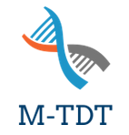

<div>
<h2>Gen-Assoc</h2>

<div>
<p>Tools and Web Service work Package<br>
M-TDT tool Documentation. 

 <a href="https://github.com/avalanche-org/Gen_Assoc"></a><p>
</div>
<hr>

<div align="center">


</div> 


# README

# Multi-Transmission Disequilibrium Test

## **What is it?**

**M-TDT** (Multi-locus Transmission Disequilibrium Test) is an open source program computing a family-based statistic testing for association between a phenotype and a set of multi-allelic markers. The program is for family-based genome-wide screening of single and joint effects of genetic mutations on infectious disease traits, either qualitative or quantitative traits, regardless of phenotype distribution.

## Context

- Many studies in Africa with recruitment in families (trio, nuclear families data)
- Study of Infectious disease (multifactorial diseases, complex traits)
- Need statistical analysis methods and tools to handle data from such studies

## **Strengths**

- Ability to find joint effects of several markers impacting phenotypes in a context of small sample size
- Retrieve markers that would be missed by classical approaches
- Handles of main statistical issues like:
    - non-specified distribution of traits
    - related individuals
    - population admixture
    - linkage disequilibrium among markers

****


*Family-based design*

## Installation

There is two ways to use M-TDT:

- Command-line : Here is the link to the CLI [https://github.com/avalanche-org/m-TDT](https://github.com/avalanche-org/m-TDT)
- The Graphical User Interface, which will be detailed

### GUI : Web Application

You can use the tool currently deployed on the Institut Pasteur servers: (link)

If you want to install the GUI version locally you have two ways to do so:

**1. Node Package Manager (npm)**


You need to have git and NodeJs installed: (and R)

[https://git-scm.com/book/en/v2/Getting-Started-Installing-Git](https://git-scm.com/book/en/v2/Getting-Started-Installing-Git)

[https://nodejs.org/en/download](https://nodejs.org/en/download)

Clone repository

```
$  git clone https://github.com/avalanche-org/Gen_Assoc.git
```

Move to Gen_Assoc/apps folder and install the required dependencies

```
$ cd Gen_Assoc; cd apps
$ npm install
```

Run the application

```
$ npm run build
```

Open your browser and type [http://localhost:4000/](http://localhost:4000/)

Here your are !

To stop the application, type **Ctrl+c** in terminal.
If the application crashes, type Ctrl+c and rerun npm run build


**2. Docker** 

For this section Docker ([Docker](https://docs.docker.com/get-docker/)) is required.

The Webservice Application docker image is available on docker registry

[Docker](https://hub.docker.com/r/jukoo/m-tdt/tags)

---

Open your terminal:

```
docker pull jukoo/m-tdt:stablev1
```

To launch the docker application

```
$  docker run -d -p <localport>:<containerPort> jukoo/m-tdt:stablev1
```

*The default port of the container is **4000***

*example*:

> `docker run -d -p 3000:4000 jukoo/m-tdt:stablev1`
> 

<aside>
💡 If you get a warning indicating a platform mismatch between the requested platform for the Docker image and the platform detected on the host machine, then add `--platform linux/amd64`  to the command

</aside>

Open your browser and type [http://localhost:3000/](http://localhost:4000/)

Here you are  🚀

## Tutorials

Once you have a version of the tool installed you can run the appropriate tutorial.

**[M-TDT Web Application tutorial](https://www.notion.so/M-TDT-Web-Application-tutorial-1ec8734fa5474a6197f259c909e78f97?pvs=21)**

Here is a link to the test dataset:
