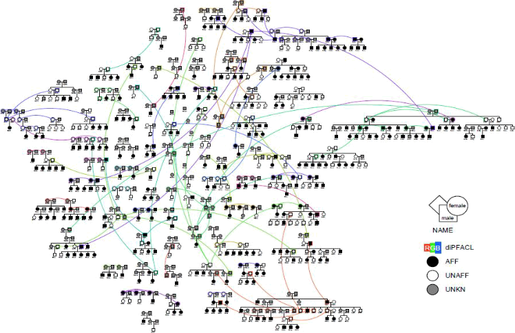
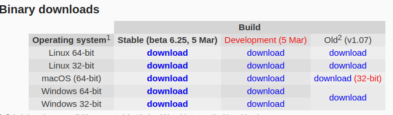
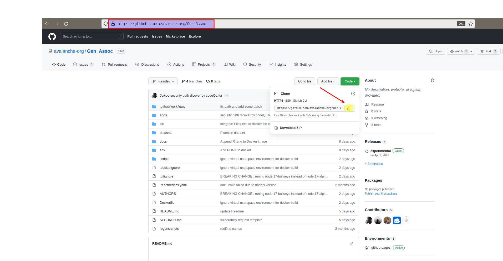
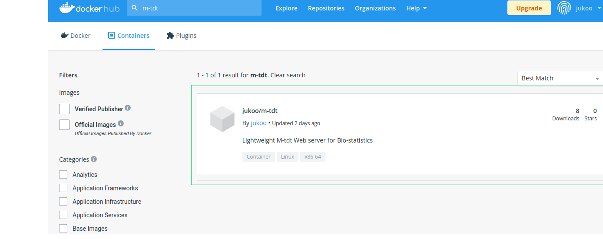

<div>
<h2>Gen-Assoc</h2>

<div>
<p>Tools and Web Service work Package<br>
M-TDT tool Documentation. 
  
 <a href="https://github.com/avalanche-org/Gen_Assoc"></a><p>
</div>
<hr>
<div align="center">


</div> 
  
  
## Index
* [Introduction](#Introduction)
* [About Gen-Assoc](#About)
* [Installation Guide line](#Installation)
	* [By Cloning](#Cloning) 
		* [Requirement](#Requirements)
	* [Using Docker Registry](#Docker)
* [Usage](#Usage)	
	* [Following Steps](#Steps)
## Introduction
* Many studies in Africa with recruitment in families (trio, nuclear families data)
* Study of Infectious disease (multifactorial diseases, complex traits)
* Need statistical analysis methods and tools to handle data from such studies

<div align="center">

<h5> Family Base Design </h5>
</div> 

##  About 
Gen-Assoc  is a  webservice version of the M-TDT (the multi-locus transmission disequilibrium test) tool. A tool developed to detect family-based multi-locus multi-allelic effects for qualitative or quantitative traits, extended from the original transmission disequilibrium test (TDT). 
##  Installation 
<span class="bg-info">Two versions of the tool are available  the CLI and the Webservice.</span>
 
 ```diff 
 ! This  Installation  guide is focused only on Webservice Version
 ```
 
 We  have two kind of installation  process in easy step  
 by <u>**cloning the repos**</u> or <u>**using  Docker container**</u> 
 
 ### Cloning
 #### Requirements
 Before  Starting  installation Part we should  tell you   the requirements to run  the Application 
 correctly.
 For the internal usage you need  to  install  [plink](https://www.cog-genomics.org/plink)  Binaries 
  
 
 *Choose your System  arichecture  type !!!* 
  
 ```diff 
 - doesn'work correctly  on busybox  
 ```
 
 And assure  that  you  have  **_git_**  and **_Nodejs_** available  in  your system  
 end  some point [_Docker_]   but it's  optional  except  if   you want build a custum image  
 with  the  existant Docker file  
  
 --- 
 First  copy the  link  and go to your terminal 
 
 
 ```bash 
 $  git clone https://github.com/avalanche-org/Gen_Assoc.git
 ``` 
 
 After then go to apps folder   and  install the requiered dependencies  
 
 ```bash  
 $ cd  Gen_Assoc  ; cd apps 
 $ npm install
 ``` 
Once   it done  you can finaly run the application  
```bash
$ npm run build 
```
 _*hint_ :
 > Check  the  package.json file  for more  command to  run
 
If you have some experience with  Docker it's may be insterresting to make your onw build.  
Some  arguments inputs are allowed to custom your docker image during the  build 
In  Dockerfile  the  Lines which  have   *ARGS ARGUMENT=value*  statement  can be modified during the build 
```diff 
+ $  docker build .   --build-arg  ARGUMENT=<_new_value_>  -t <your_tag_name>
```
#### Docker 
For  this  section  Docker  only is required .  
The  Webservice  is Avalaible  on docker Registry  
``` 
$ docker search  m-tdt   
```  
 <figcaption>
 <legend> From<a href="https://hub.docker.com/search?q=m-tdt&type=image"> Docker hub</a></legend>
 <hr>
 
 </figcaption>
 
 You  can pull   Directly   The  Webservice app  directly  from the docker  Registry 
```diff
+ $  docker pull  jukoo/m-tdt
```
 
To  launch  The  docker application 
```bash
$  docker  run  -d  -p <localport>:<containerPort> jukoo/m-tdt  
```
_The default port of  the container is **4000**_ 
<u>_example_</u>: 
>  **docker run  -d  -p 3000:4000  jukoo/m-tdt**
Here you are  now  let's see  to get your work done :rocket: 
##  Usage 
#### Steps
**Love  Pull Request** 

